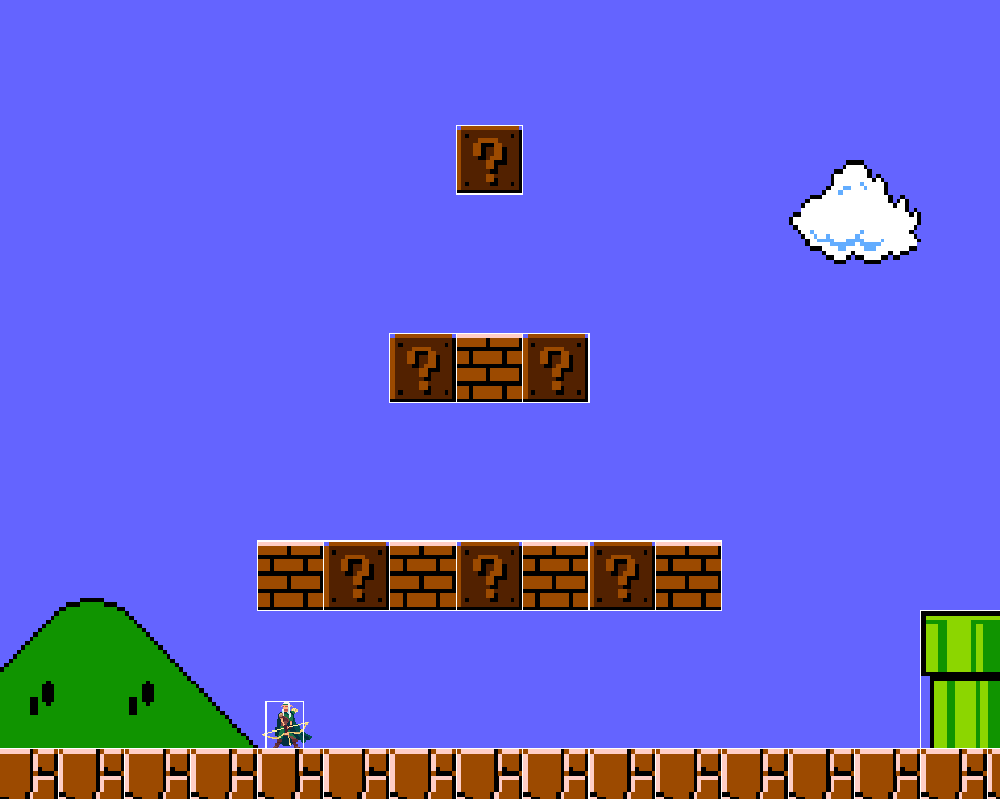
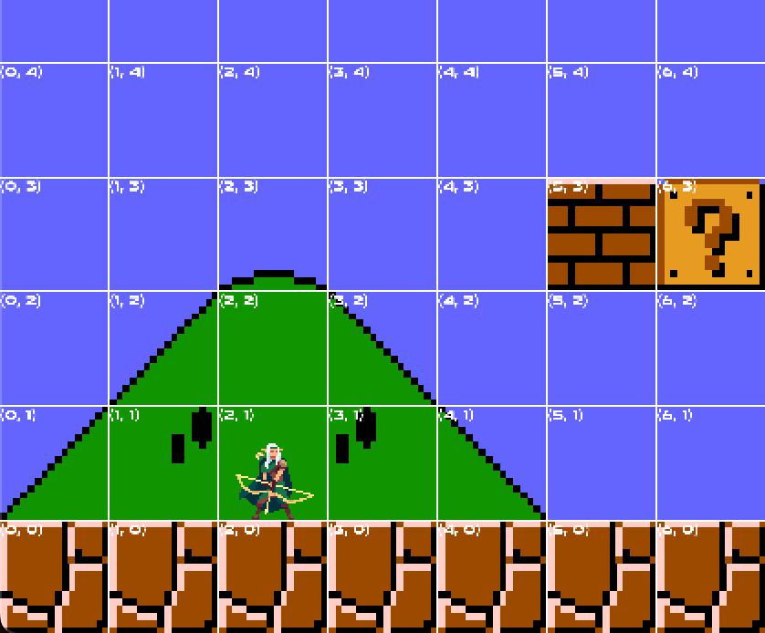

## What, and Why?
Ever since playing my first games 20 years ago, I wondered about the magic behind games. This engine was an attempt at understanding them, from the bottom-up.

---
## Architecture
My engine uses a simplified entity-component-system (ECS) architecture. Entities are objects of the Entity class which hold a tuple of Component objects - each Component class composed almost entirely of data. Systems modifying this data are implemented per-scene, keeping game logic self-contained.

I chose ECS over a traditional OOP hierarchy for two reasons. Firstly, it avoids the fragile base-class problem: adding a new behaviour involves writing a new component and system, not modifying an inheritance chain. Secondly, it improves cache coherency by keeping component data grouped in contiguous memory, reducing cache misses when systems iterate over large entity counts.

---
## Core Components
### Scene Management
The scene management system organises the various states of the game, such as menus, levels, and game over screens.

Each scene is derived from a base Scene class, which provides essential functionality like action registration and rendering. The GameEngine class maintains a map of available scenes, allowing for quick access and dynamic changes. When transitioning between scenes, the `changeScene()` method of the GameEngine class updates the current scene and ensures that the new scene is properly initialised.

This modular design not only enhances organisation but also simplifies the addition of new scenes, making it easier to expand a game’s content.


### Input Handling with Action System
The input system is designed to be flexible and responsive, allowing players to interact with the game seamlessly. It utilises a mapping of keyboard inputs to specific actions, which are registered in each scene. The `sUserInput()` method in the GameEngine class polls for events from the SFML window, checking for key presses and releases. 

When a key is pressed or released, the system looks up the corresponding action in the current scene's action map (a mapping of SFML key code to a string) and triggers the appropriate response. 

This design allows for easy remapping of controls, ensures that each scene can define its own unique set of actions, and enables an action-replay system.

```cpp
// At scene level: add potential actions to scene's action map
void ScenePlatformer::init()
{
    registerAction(sf::Keyboard::W, "UP");
    registerAction(sf::Keyboard::A, "LEFT");
    registerAction(sf::Keyboard::D, "RIGHT");
    registerAction(sf::Keyboard::Space, "SHOOT");
}
```

```cpp
// At game engine level: listen for input, and if action exists in the current scene's action map, make the scene enact the action
void GameEngine::sUserInput()
{
	sf::Event event;
	while (m_window.pollEvent(event))
	{
		switch (event.type)
		{
			case sf::Event::KeyPressed:
			case sf::Event::KeyReleased:
				// If action exists in current scene's action map, scene performs action
				if (getCurrentScene()->getActionMap().find(event.key.code) != getCurrentScene()->getActionMap().end())
				{
					const std::string actionType = (event.type == sf::Event::KeyPressed) ? "START" : "END";
					getCurrentScene()->sDoAction(Action(getCurrentScene()->getActionMap().at(event.key.code), actionType));
				}
			
			// More cases...
		}
	}
}
```


### Movement System
The movement system is responsible for updating the positions of entities based on player input and physics calculations.

Each entity can have a Body component that contains properties such as velocity and acceleration. The `sMovement()` method in the ScenePlatformer class processes input actions to adjust the entity's velocity accordingly.

For example, pressing the left or right keys modifies the horizontal velocity, while the jump key changes the vertical velocity if the player is grounded. 

The system also incorporates gravity, which continuously affects the vertical velocity of the player, ensuring realistic movement dynamics.

### Collision System


The collision system is crucial for maintaining the integrity of the game world by preventing entities from overlapping inappropriately. It employs an axis-aligned bounding box (AABB) approach to detect collisions between entities.

The `sCollision() `method in the ScenePlatformer class iterates through pairs of entities, checking for overlaps using their bounding boxes. When a collision is detected, the system determines the type of collision (e.g., player with tile, arrow with solid) and executes the appropriate response, such as pushing the player out of an object or destroying an entity.

This system is crucial for ensuring entities react with each other realistically, for example stopping the player falling through the floor, or detecting an arrow hitting another entity, causing it's destruction.

```cpp
// Part of sCollisions() in ScenePlatformer class

EntityVector& entities = m_entityManager.getEntities();
size_t entityCount = entities.size();

for (size_t i = 0; i < entityCount; ++i)
{
	auto& a = entities[i];

	if (!a->hasComponent<CBody>())
	{
		continue;
	}

	for (int j = i + 1; j < entityCount; ++j)
	{
		auto& b = entities[j];

		if (!b->hasComponent<CBody>())
		{
			continue;
		}

		Vec2f overlap = Physics::getOverlap(a, b);
		if (overlap.x > 0 && overlap.y > 0)
		{
			if (a == m_player || b == m_player)
			{
				handlePlayerCollision((a == m_player) ? b : a);
			}
			// If a combination of arrow and solid, handle collision according
			else if((a->getTag() == "Arrow" || b->getTag() == "Arrow") && (a->getTag() == "Solid" || b->getTag() == "Solid"))
			{
				bool aIsArrow = a->getTag() == "Arrow";
				handleArrowCollision(aIsArrow ? a : b, aIsArrow ? b : a);
			}
		}
	}
}
```


### Animation System

  
  


The animation system is designed to provide smooth and dynamic character movements. Each entity can have an Animation component that stores the current animation and its properties, such as whether it should loop. Player animations are linked to the player's State component, which can take values including running, jumping, or shooting, ensuring that the correct animation plays in response to player actions.

The system assumes horizontally-organised sprite sheets, and uses the information specified in assets.txt (specifically, the number of frames the animation consists of) to display the correct portion of the sprite sheet each frame. This approach simplifies the management of sprite assets and enhances the flexibility of the animation system, enabling developers to easily adjust and expand animations as needed.

The system efficiently checks for animation completion and handles transitions seamlessly, allowing for features like looping animations or one-time effects. 

By decoupling the animation logic from the game entities, developers can easily extend and modify animations without affecting the core gameplay mechanics, fostering a flexible and maintainable codebase. 

```cpp
void ScenePlatformer::sAnimation()
{
	for (auto& entity : m_entityManager.getEntities())
	{
		// If entity has Animation component, either update it, or remove if has ended
		if (entity->hasComponent<CAnimation>())
		{
			bool hasEnded = entity->getComponent<CAnimation>().update();
			if (hasEnded)
			{
				endAnimation(entity);
			}

			if (entity == m_player)
			{
				// If player state has changed, change animation
				const CState& stateComponent = m_player->getComponent<CState>();
				if (stateComponent.currentState != stateComponent.previousState)
				{
					changePlayerAnimation();
				}
			}
		}
	}
}
```


### Rendering System
The window, graphical rendering, and sound are handled by SFML, to enable me to focus on the higher-level engine features.

The rendering system is responsible for visually displaying the game world and its entities on the screen. It operates within the sRender() method, which clears the window, sets the view, and draws all entities in the correct order.

The system first renders background elements and then iterates through the entity manager to draw each entity using the renderEntity() method. Special care is taken to render the player last, ensuring it appears on top of other entities.

```cpp
// Part of sRender() in ScenePlatformer class

EntityVector& entities = m_entityManager.getEntities();

// Check whether player exists
auto playerIterator = std::find_if(entities.begin(), entities.end(), [](std::shared_ptr<Entity> e)
{
	return e->getTag() == "Player";
});

// If player exists, move to end of entity vector, so only a single pass needed
if (playerIterator != entities.end())
{
	std::shared_ptr<Entity> player = *playerIterator;
	entities.erase(playerIterator);
	entities.push_back(player);
} 

// Drawing of textures/animations and bounding boxes
for (auto entity : entities)
{
	renderEntity(entity);
}
```

Additionally, the system includes options for debugging, such as rendering bounding boxes and a grid, which can be toggled on or off:

<div class="media-container">
    
	
</div>

---
## Design Considerations
A key design consideration was the implementation of collision detection and resolution within the `Physics` namespace.

In my engine, collision detection relies on axis-aligned bounding boxes (AABB). To detect a collision, the overlap between two entities' bounding boxes is calculated. If there’s overlap along both the X and Y axes, this indicates a collision.

To resolve the collision, the direction in which to push the entity must be determined — either along the Y axis (for example, when the player lands on a block) or the X axis (such as when the player runs into a wall). To achieve this, the overlap between the two objects in the previous frame is calculated:

```cpp
bool resolveCollision(std::shared_ptr<Entity> a, std::shared_ptr<Entity> b)
{
    const Vec2f previousOverlap = Physics::getPreviousOverlap(a, b);
    bool isXDirection = previousOverlap.x <= 0 && previousOverlap.y > 0;
    moveEntity(a, b, isXDirection);
    return isXDirection;
}
```

To avoid code duplication, I implemented a helper function, `getOverlapHelper`, which calculates the overlap for either the current or the previous frame based on a boolean flag. This function is placed in an anonymous namespace to limit its scope to the current file, ensuring encapsulation. Only the public-facing functions, `getOverlap` and `getPreviousOverlap`, are part of the `Physics` namespace:

```cpp
// "Public" interface
namespace Physics
{
	Vec2f getOverlap(std::shared_ptr<Entity> a, std::shared_ptr<Entity> b)
	{
		return getOverlapHelper(a, b, false);
	}
	
	Vec2f getPreviousOverlap(std::shared_ptr<Entity> a, std::shared_ptr<Entity> b)
	{
		return getOverlapHelper(a, b, true);
	}
}
```

These functions rely on `getOverlapHelper` to handle the core logic:

```cpp
// Anonymous namespace -> essentially "private" helper function
namespace
{
	// Helper function to avoid code repetition
	Vec2f getOverlapHelper(std::shared_ptr<Entity> a, std::shared_ptr<Entity> b, bool usePrevious)
	{
		if (a->hasComponent<CBody>() && b->hasComponent<CBody>() && a->hasComponent<CTransform>() && b->hasComponent<CTransform>())
		{
			const Vec2f positionA = usePrevious ? a->getComponent<CTransform>().previousPosition : a->getComponent<CTransform>().position;
			const Vec2f positionB = usePrevious ? b->getComponent<CTransform>().previousPosition : b->getComponent<CTransform>().position;
			
			const Vec2f halfSizeA = a->getComponent<CBody>().bBox.size / 2.0f;
			const Vec2f halfSizeB = b->getComponent<CBody>().bBox.size / 2.0f;
			
			Vec2f overlap;
			
			float diffX = std::abs(positionA.x - positionB.x);
			overlap.x = halfSizeA.x + halfSizeB.x - diffX;
			
			float diffY = std::abs(positionA.y - positionB.y);
			overlap.y = halfSizeA.y + halfSizeB.y - diffY;
			
			return overlap;
		}

		std::cerr << "Physics.cpp: one or both entities lack a CBody or CTransform." << std::endl;
		return Vec2f(0.0f, 0.0f);
	}
}
```

---
## Future Improvements
Several enhancements are planned:

* The collision handling in the sCollision method iterates through all entities in a nested loop, which can lead to performance bottleneck, especially with a large number of entities. Instead, I could implement spatial partitioning techniques (like quad-trees) to reduce the number of collision checks.

* The player state management in ScenePlatformer uses a series of if-else statements to determine the player's state based on velocity. This can become cumbersome and error-prone as more states are added. A state machine design pattern could improve clarity and maintainability.

* For clarity, I have used strings to hold information, for example the names of animations, scenes, and actions and their types (i.e. start or end). However, a more efficient data structure to store the names of actions and animations would be an enum.

---
## Next Steps
I’m excited to continue developing this engine by implementing a level creation tool and a save system.

I will then further generalise the engine to facilitate the development of a rhythm-based top-down shooter (think Metal: Hellsinger, neon geometric shapes, and house music!), for which I will also implement a particle effects system, global illumination using radiance cascades, and NPC pathfinding.

---
### Acknowledgements
Assets used in the project include the [Elementals: Leaf Ranger asset pack](https://chierit.itch.io/elementals-leaf-ranger) by chierit, [Fantasy World Explosion pack](https://xthekendrick.itch.io/2d-explosions-pixel-art-pack-1) by Kenrick ML, and [Super Mario World block and coin sprites](https://www.spriters-resource.com/nes/supermariobros/).